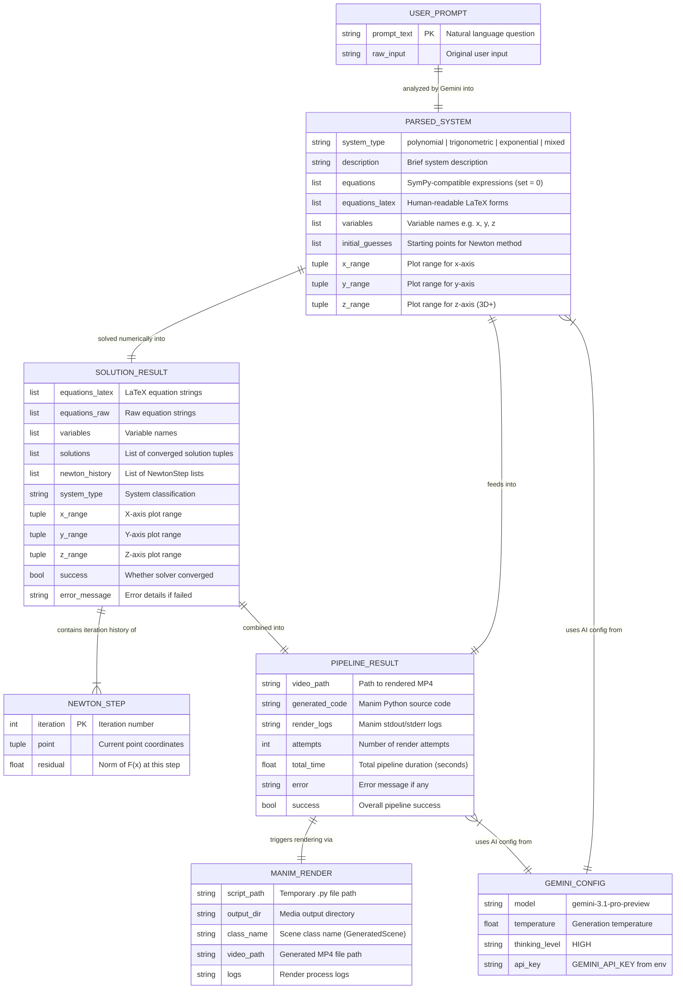

# ER Diagram — Nonlinear Systems Solver

> Entity-Relationship diagram representing the core data structures, their attributes, and relationships.

```mermaid
erDiagram
    USER_PROMPT {
        string prompt_text PK "Natural language question"
        string raw_input "Original user input"
    }

    PARSED_SYSTEM {
        string system_type "polynomial | trigonometric | exponential | mixed"
        string description "Brief system description"
        list equations "SymPy-compatible expressions (set = 0)"
        list equations_latex "Human-readable LaTeX forms"
        list variables "Variable names e.g. x, y, z"
        list initial_guesses "Starting points for Newton method"
        tuple x_range "Plot range for x-axis"
        tuple y_range "Plot range for y-axis"
        tuple z_range "Plot range for z-axis (3D+)"
    }

    NEWTON_STEP {
        int iteration PK "Iteration number"
        tuple point "Current point coordinates"
        float residual "Norm of F(x) at this step"
    }

    SOLUTION_RESULT {
        list equations_latex "LaTeX equation strings"
        list equations_raw "Raw equation strings"
        list variables "Variable names"
        list solutions "List of converged solution tuples"
        list newton_history "List of NewtonStep lists"
        string system_type "System classification"
        tuple x_range "X-axis plot range"
        tuple y_range "Y-axis plot range"
        tuple z_range "Z-axis plot range"
        bool success "Whether solver converged"
        string error_message "Error details if failed"
    }

    PIPELINE_RESULT {
        string video_path "Path to rendered MP4"
        string generated_code "Manim Python source code"
        string render_logs "Manim stdout/stderr logs"
        int attempts "Number of render attempts"
        float total_time "Total pipeline duration (seconds)"
        string error "Error message if any"
        bool success "Overall pipeline success"
    }

    MANIM_RENDER {
        string script_path "Temporary .py file path"
        string output_dir "Media output directory"
        string class_name "Scene class name (GeneratedScene)"
        string video_path "Generated MP4 file path"
        string logs "Render process logs"
    }

    GEMINI_CONFIG {
        string model "gemini-3.1-pro-preview"
        float temperature "Generation temperature"
        string thinking_level "HIGH"
        string api_key "GEMINI_API_KEY from env"
    }

    USER_PROMPT ||--|| PARSED_SYSTEM : "analyzed by Gemini into"
    PARSED_SYSTEM ||--|| SOLUTION_RESULT : "solved numerically into"
    SOLUTION_RESULT ||--|{ NEWTON_STEP : "contains iteration history of"
    PARSED_SYSTEM ||--|| PIPELINE_RESULT : "feeds into"
    SOLUTION_RESULT ||--|| PIPELINE_RESULT : "combined into"
    PIPELINE_RESULT ||--|| MANIM_RENDER : "triggers rendering via"
    PARSED_SYSTEM }|--|| GEMINI_CONFIG : "uses AI config from"
    PIPELINE_RESULT }|--|| GEMINI_CONFIG : "uses AI config from"
```
