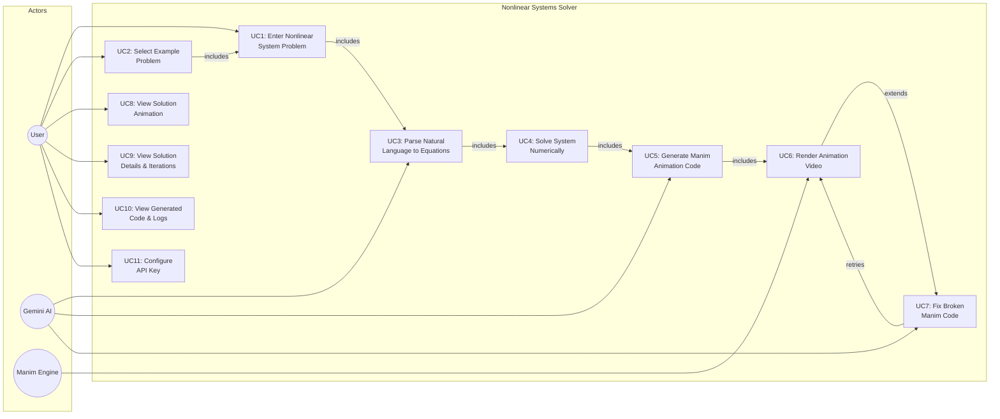

# Use Case Diagram — Nonlinear Systems Solver

> Illustrates the actors (User, Gemini AI, Manim Engine) and the use cases they participate in.

## Use Case Descriptions

| ID   | Use Case                        | Actor(s)         | Description                                                                                     |
|------|----------------------------------|------------------|-------------------------------------------------------------------------------------------------|
| UC1  | Enter Nonlinear System Problem   | User             | User types a natural language description of a nonlinear system into the text input              |
| UC2  | Select Example Problem           | User             | User clicks a pre-defined example (2-var, 3-var, or 4-var system) to auto-fill the input         |
| UC3  | Parse Natural Language           | Gemini AI        | Gemini analyzes the prompt and extracts equations, variables, initial guesses, and ranges         |
| UC4  | Solve System Numerically         | System           | Newton's method is applied with multiple initial guesses to find all solutions                    |
| UC5  | Generate Manim Animation Code    | Gemini AI        | Gemini generates a complete Manim scene based on the parsed system and solution data              |
| UC6  | Render Animation Video           | Manim Engine     | Manim subprocess compiles the Python code into an MP4 video                                      |
| UC7  | Fix Broken Manim Code            | Gemini AI        | On render failure, Gemini analyzes error logs and produces corrected code (up to 3 retries)       |
| UC8  | View Solution Animation          | User             | User watches the auto-playing rendered video showing curves, Newton iterations, and solutions     |
| UC9  | View Solution Details            | User             | User reads the solution coordinates, iteration tables, and system analysis in the details panel   |
| UC10 | View Generated Code & Logs       | User             | User expands the accordion to inspect generated Manim code and render logs                       |
| UC11 | Configure API Key                | User             | User sets `GEMINI_API_KEY` in the `.env` file for the system to authenticate with Google Gemini   |
