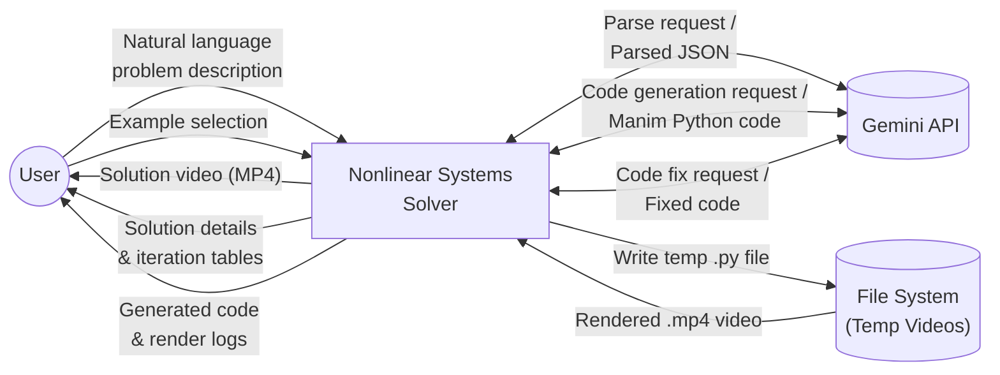
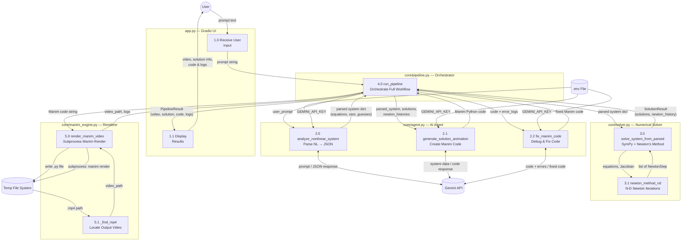

# DFD — Nonlinear Systems Solver

> Data Flow Diagrams showing how data moves between processes, data stores, and external entities.

---

## Level 0 — Context Diagram

---

## Level 1 — Detailed Data Flow

