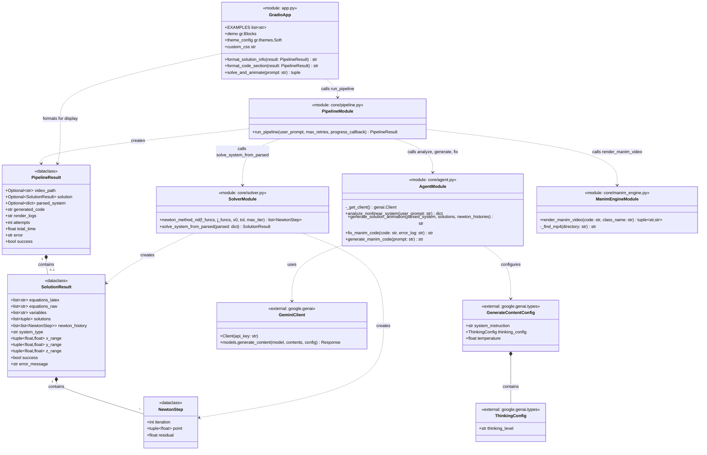

# Class Diagram — Nonlinear Systems Solver

> Shows all classes (dataclasses), module-level functions, and their relationships.

```mermaid
classDiagram
    direction TB

    class NewtonStep {
        <<dataclass>>
        +int iteration
        +tuple~float~ point
        +float residual
    }

    class SolutionResult {
        <<dataclass>>
        +list~str~ equations_latex
        +list~str~ equations_raw
        +list~str~ variables
        +list~tuple~ solutions
        +list~list~NewtonStep~~ newton_history
        +str system_type
        +tuple~float,float~ x_range
        +tuple~float,float~ y_range
        +tuple~float,float~ z_range
        +bool success
        +str error_message
    }

    class PipelineResult {
        <<dataclass>>
        +Optional~str~ video_path
        +Optional~SolutionResult~ solution
        +Optional~dict~ parsed_system
        +str generated_code
        +str render_logs
        +int attempts
        +float total_time
        +str error
        +bool success
    }

    class SolverModule {
        <<module: core/solver.py>>
        +newton_method_nd(f_funcs, j_funcs, x0, tol, max_iter) list~NewtonStep~
        +solve_system_from_parsed(parsed: dict) SolutionResult
    }

    class AgentModule {
        <<module: core/agent.py>>
        -_get_client() genai.Client
        +analyze_nonlinear_system(user_prompt: str) dict
        +generate_solution_animation(parsed_system, solutions, newton_histories) str
        +fix_manim_code(code: str, error_log: str) str
        +generate_manim_code(prompt: str) str
    }

    class PipelineModule {
        <<module: core/pipeline.py>>
        +run_pipeline(user_prompt, max_retries, progress_callback) PipelineResult
    }

    class ManimEngineModule {
        <<module: core/manim_engine.py>>
        +render_manim_video(code: str, class_name: str) tuple~str,str~
        -_find_mp4(directory: str) str
    }

    class GradioApp {
        <<module: app.py>>
        +EXAMPLES list~str~
        +format_solution_info(result: PipelineResult) str
        +format_code_section(result: PipelineResult) str
        +solve_and_animate(prompt: str) tuple
        +demo gr.Blocks
        +theme_config gr.themes.Soft
        +custom_css str
    }

    class GeminiClient {
        <<external: google.genai>>
        +Client(api_key: str)
        +models.generate_content(model, contents, config) Response
    }

    class GenerateContentConfig {
        <<external: google.genai.types>>
        +str system_instruction
        +ThinkingConfig thinking_config
        +float temperature
    }

    class ThinkingConfig {
        <<external: google.genai.types>>
        +str thinking_level
    }

    %% Relationships
    SolutionResult "1" *-- "*" NewtonStep : contains
    PipelineResult "1" *-- "0..1" SolutionResult : contains
    PipelineModule ..> PipelineResult : creates
    PipelineModule ..> AgentModule : calls analyze, generate, fix
    PipelineModule ..> SolverModule : calls solve_system_from_parsed
    PipelineModule ..> ManimEngineModule : calls render_manim_video
    SolverModule ..> NewtonStep : creates
    SolverModule ..> SolutionResult : creates
    AgentModule ..> GeminiClient : uses
    AgentModule ..> GenerateContentConfig : configures
    GenerateContentConfig *-- ThinkingConfig : contains
    GradioApp ..> PipelineModule : calls run_pipeline
    GradioApp ..> PipelineResult : formats for display
```
