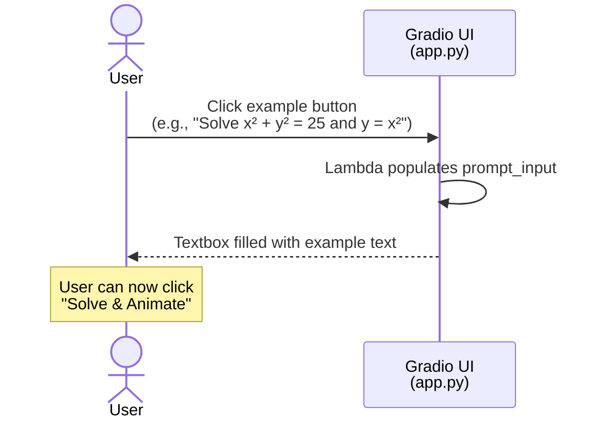

# Sequence Diagram — Nonlinear Systems Solver

> Shows the end-to-end interaction flow when a user submits a nonlinear system problem.

## Main Flow: Solve & Animate

```mermaid
sequenceDiagram
    actor User
    participant UI as Gradio UI<br/>(app.py)
    participant Pipeline as Pipeline<br/>(core/pipeline.py)
    participant Agent as AI Agent<br/>(core/agent.py)
    participant Gemini as Gemini API<br/>(External)
    participant Solver as Solver<br/>(core/solver.py)
    participant Engine as Manim Engine<br/>(core/manim_engine.py)
    participant FS as File System<br/>(Temp Dir)

    User->>UI: Enter problem / click example
    User->>UI: Click "Solve & Animate"
    UI->>UI: Validate input & API key
    UI->>Pipeline: solve_and_animate(prompt)
    activate Pipeline

    Note over Pipeline: Step 1 — Parse System
    Pipeline->>Agent: analyze_nonlinear_system(prompt)
    activate Agent
    Agent->>Agent: _get_client()
    Agent->>Gemini: generate_content(prompt, system_instruction)
    Gemini-->>Agent: JSON response (equations, vars, guesses)
    Agent->>Agent: Clean markdown, parse JSON, validate
    Agent-->>Pipeline: parsed_system dict
    deactivate Agent

    Note over Pipeline: Step 2 — Solve Numerically
    Pipeline->>Solver: solve_system_from_parsed(parsed)
    activate Solver
    Solver->>Solver: Create SymPy symbols & expressions
    Solver->>Solver: Compute Jacobian symbolically
    Solver->>Solver: Lambdify functions for NumPy

    loop For each initial guess
        Solver->>Solver: newton_method_nd(f_funcs, j_funcs, x0)
        Note right of Solver: Iterate until ||F(x)|| < tol<br/>or max_iter reached
        Solver->>Solver: Record NewtonStep per iteration
        Solver->>Solver: Check convergence & dedup solutions
    end

    Solver-->>Pipeline: SolutionResult (solutions, history)
    deactivate Solver

    Note over Pipeline: Step 3 — Generate Animation Code
    Pipeline->>Agent: generate_solution_animation(parsed, solutions, histories)
    activate Agent
    Agent->>Agent: Format solution data for prompt
    Agent->>Agent: Select 2D/3D/text plotting instructions
    Agent->>Gemini: generate_content(system_instruction with data)
    Gemini-->>Agent: Manim Python code
    Agent->>Agent: Clean markdown wrappers
    Agent-->>Pipeline: Manim code string
    deactivate Agent

    Note over Pipeline: Step 4 — Render with Retries
    loop Attempt 1..max_retries (3)
        Pipeline->>Engine: render_manim_video(code)
        activate Engine
        Engine->>FS: Write scene.py to temp dir
        Engine->>FS: subprocess: manim render scene.py GeneratedScene -ql
        FS-->>Engine: Process exit (stdout + stderr)
        Engine->>Engine: _find_mp4(output_dir)

        alt Render Success
            Engine-->>Pipeline: (video_path, logs)
            deactivate Engine
            Note over Pipeline:  Break loop
        else Render Failed
            Engine-->>Pipeline: (None, error_logs)
            deactivate Engine
            Pipeline->>Agent: fix_manim_code(code, logs)
            activate Agent
            Agent->>Gemini: generate_content(code + error_log)
            Gemini-->>Agent: Fixed Manim code
            Agent-->>Pipeline: fixed_code
            deactivate Agent
            Note over Pipeline:  Retry with fixed code
        end
    end

    Pipeline-->>UI: PipelineResult
    deactivate Pipeline

    UI->>UI: format_solution_info(result)
    UI->>UI: format_code_section(result)
    UI-->>User: Display video + solution details + code
```

## Alternative Flow: Example Selection


