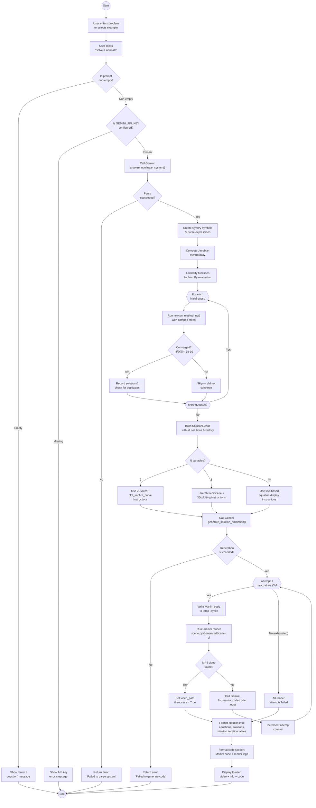

# Activity Diagram — Nonlinear Systems Solver

> Shows the step-by-step workflow and decision points in the pipeline execution.

```mermaid
flowchart TD
    Start((" Start"))
    InputPrompt["User enters problem\nor selects example"]
    ClickSolve["User clicks\n'Solve & Animate'"]
    ValidateInput{"Is prompt\nnon-empty?"}
    ValidateKey{"Is GEMINI_API_KEY\nconfigured?"}
    ShowKeyError["️ Show API key\nerror message"]
    ShowEmptyError["️ Show 'enter a\nquestion' message"]

    ParseSystem[" Call Gemini:\nanalyze_nonlinear_system()"]
    ParseSuccess{"Parse\nsucceeded?"}
    ParseError[" Return error:\n'Failed to parse system'"]

    CreateSymbols["Create SymPy symbols\n& parse expressions"]
    ComputeJacobian["Compute Jacobian\nsymbolically"]
    Lambdify["Lambdify functions\nfor NumPy evaluation"]

    InitGuessLoop{{"For each\ninitial guess"}}
    RunNewton["Run newton_method_nd()\nwith damped steps"]
    CheckConverge{"Converged?\n||F(x)|| < 1e-10"}
    RecordSolution["Record solution &\ncheck for duplicates"]
    SkipGuess["Skip — did not\nconverge"]
    EndGuessLoop{{"More guesses?"}}

    SolverDone["Build SolutionResult\nwith all solutions & history"]

    GenAnimation[" Call Gemini:\ngenerate_solution_animation()"]
    Select2D{"N variables?"}
    Use2D["Use 2D Axes +\nplot_implicit_curve instructions"]
    Use3D["Use ThreeDScene +\n3D plotting instructions"]
    UseND["Use text-based\nequation display instructions"]
    GenSuccess{"Generation\nsucceeded?"}
    GenError[" Return error:\n'Failed to generate code'"]

    RenderLoop{{"Attempt ≤\nmax_retries (3)?"}}
    WriteTemp["Write Manim code\nto temp .py file"]
    RunManim["Run: manim render\nscene.py GeneratedScene -ql"]
    FindVideo{"MP4 video\nfound?"}
    RenderSuccess[" Set video_path\n& success = True"]
    FixCode[" Call Gemini:\nfix_manim_code(code, logs)"]
    IncrementAttempt["Increment attempt\ncounter"]

    AllFailed[" All render\nattempts failed"]

    FormatInfo["Format solution info:\nequations, solutions,\nNewton iteration tables"]
    FormatCode["Format code section:\nManim code + render logs"]
    DisplayResults["Display to user:\nvideo + info + code"]

    End((" End"))

    %% Flow
    Start --> InputPrompt --> ClickSolve --> ValidateInput
    ValidateInput -->|"Empty"| ShowEmptyError --> End
    ValidateInput -->|"Non-empty"| ValidateKey
    ValidateKey -->|"Missing"| ShowKeyError --> End
    ValidateKey -->|"Present"| ParseSystem

    ParseSystem --> ParseSuccess
    ParseSuccess -->|"No"| ParseError --> End
    ParseSuccess -->|"Yes"| CreateSymbols

    CreateSymbols --> ComputeJacobian --> Lambdify --> InitGuessLoop

    InitGuessLoop --> RunNewton --> CheckConverge
    CheckConverge -->|"Yes"| RecordSolution --> EndGuessLoop
    CheckConverge -->|"No"| SkipGuess --> EndGuessLoop
    EndGuessLoop -->|"Yes"| InitGuessLoop
    EndGuessLoop -->|"No"| SolverDone

    SolverDone --> Select2D
    Select2D -->|"2"| Use2D --> GenAnimation
    Select2D -->|"3"| Use3D --> GenAnimation
    Select2D -->|"4+"| UseND --> GenAnimation

    GenAnimation --> GenSuccess
    GenSuccess -->|"No"| GenError --> End
    GenSuccess -->|"Yes"| RenderLoop

    RenderLoop -->|"Yes"| WriteTemp --> RunManim --> FindVideo
    FindVideo -->|"Yes"| RenderSuccess --> FormatInfo
    FindVideo -->|"No"| FixCode --> IncrementAttempt --> RenderLoop
    RenderLoop -->|"No (exhausted)"| AllFailed --> FormatInfo

    FormatInfo --> FormatCode --> DisplayResults --> End
```
